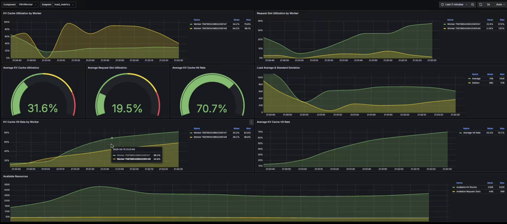

# Metrics

The `metrics` component is a utility that can collect, aggregate, and publish
metrics from a Dynamo deployment for use in other applications or visualization
tools like Prometheus and Grafana.

<div align="center">
  
</div>

## Quickstart

To start the `metrics` component, simply point it at the `namespace/component/endpoint`
trio for the Dynamo workers that you're interested in monitoring metrics on.

This will:
1. Collect statistics from workers associated with that `namespace/component/endpoint`
2. Postprocess and aggregate those statistics across the workers
3. Publish them on a Prometheus-compatible metrics endpoint

For example:
```bash
# Default namespace is "dynamo", but can be configured with --namespace
# For more detailed output, try setting the env var: DYN_LOG=debug
metrics --component my_component --endpoint my_endpoint

# 2025-03-17T00:07:05.202558Z  INFO metrics: Scraping endpoint dynamo/my_component/my_endpoint for stats
# 2025-03-17T00:07:05.202955Z  INFO metrics: Prometheus metrics server started at 0.0.0.0:9091/metrics
# ...
```

With no matching endpoints running to collect stats from, you should see warnings in the logs:
```bash
2025-03-17T00:07:06.204756Z  WARN metrics: No endpoints found matching dynamo/my_component/my_endpoint
```

After a worker with a matching endpoint gets started, the endpoint
will get automatically discovered and the warnings will stop.

## Workers

The `metrics` component needs running workers to gather metrics from,
so below are some examples of workers and how they can be monitored.

### Mock Worker

For quick testing and debugging, there is a Rust-based
[mock worker](src/bin/mock_worker.rs) that registers a mock
`StatsHandler` under an endpoint named
`dynamo/my_component/my_endpoint` and publishes random data.

```bash
# Can run multiple workers in separate shells to see aggregation as well.
# Or to build/run from source: cargo run --bin mock_worker
mock_worker

# 2025-03-16T23:49:28.101668Z  INFO mock_worker: Starting Mock Worker on Endpoint: dynamo/my_component/my_endpoint
```

To monitor the metrics of these mock workers, run:
```bash
metrics --component my_component --endpoint my_endpoint
```

### Real Worker

To run a more realistic deployment to gathering metrics from,
see the examples in [examples/llm](../../examples/llm).

For example, for a VLLM + KV Routing based deployment that
exposes statistics on an endpoint labeled
`dynamo/VllmWorker/load_metrics`:
```bash
cd deploy/examples/llm
dynamo serve <vllm kv routing example args>
```

To monitor the metrics of these VllmWorkers, run:
```bash
metrics --component VllmWorker --endpoint load_metrics
```

**NOTE**: `load_metrics` is currently a
[hard-coded](https://github.com/ai-dynamo/dynamo/blob/d5220c7b1151372ba3d2a061c7d0a7ed72724789/lib/llm/src/kv_router/publisher.rs#L108)
endpoint name used for python-based workers that register a `KvMetricsPublisher`.

## Visualization

To visualize the metrics being exposed on the Prometheus endpoint,
see the Prometheus and Grafana configurations in
[deploy/metrics](../../deploy/metrics):
```bash
docker compose -f deploy/docker-compose.yml --profile metrics up -d
```

## Metrics Collection Modes

The metrics component supports two modes for exposing metrics in a Prometheus format:

### Pull Mode (Default)

When running in pull mode (the default), the metrics component will expose a
Prometheus metrics endpoint on the specified host and port that a
Prometheus server or curl client can pull from:

```bash
# Start metrics server on default host (0.0.0.0) and port (9091)
metrics --component my_component --endpoint my_endpoint

# Or specify a custom port
metrics --component my_component --endpoint my_endpoint --port 9092
```

In pull mode:
- The `--host` parameter must be a valid IPv4 or IPv6 address (e.g., "0.0.0.0", "127.0.0.1")
- The `--port` parameter specifies which port the HTTP server will listen on

You can then query the metrics using:
```bash
curl localhost:9091/metrics

# # HELP llm_kv_blocks_active Active KV cache blocks
# # TYPE llm_kv_blocks_active gauge
# llm_kv_blocks_active{component="my_component",endpoint="my_endpoint",worker_id="7587884888253033398"} 40
# llm_kv_blocks_active{component="my_component",endpoint="my_endpoint",worker_id="7587884888253033401"} 2
# # HELP llm_kv_blocks_total Total KV cache blocks
# # TYPE llm_kv_blocks_total gauge
# llm_kv_blocks_total{component="my_component",endpoint="my_endpoint",worker_id="7587884888253033398"} 100
# llm_kv_blocks_total{component="my_component",endpoint="my_endpoint",worker_id="7587884888253033401"} 100
```

### Push Mode

For ephemeral or batch jobs, or when metrics need to be pushed through a firewall,
you can use Push mode. In this mode, the metrics component will periodically push
metrics to an externally hosted
[Prometheus PushGateway](https://prometheus.io/docs/instrumenting/pushing/):

Start a prometheus push gateway service via docker:
```bash
docker run --rm -d -p 9091:9091 --name pushgateway prom/pushgateway
```

Start the metrics component in `--push` mode, specifying the host and port of your PushGateway:
```bash
# Push metrics to a Prometheus PushGateway every --push-interval seconds
metrics \
    --component my_component \
    --endpoint my_endpoint \
    --host 127.0.0.1 \
    --port 9091 \
    --push
```

When using Push mode:
- The `--host` parameter must be a valid IPv4 or IPv6 address (e.g., "0.0.0.0", "127.0.0.1")
  that the Prometheus PushGateway is running on
- The `--port` parameter specifies the port of the Prometheus PushGateway
- The push interval can be configured with `--push-interval` (default: 2 seconds)
- A default job name of "dynamo_metrics" is used for the Prometheus job label
- Metrics persist in the PushGateway until explicitly deleted
- Prometheus should be configured to scrape the PushGateway with `honor_labels: true`

To view the metrics hosted on the PushGateway:
```bash
# View all metrics
# curl http://<pushgateway_ip>:<pushgateway_port>/metrics
curl 127.0.0.1:9091/metrics
```

## Building/Running from Source

For easy iteration while making edits to the metrics component, you can use `cargo run`
to build and run with your local changes:

```bash
cargo run --bin metrics -- --component my_component --endpoint my_endpoint
```

