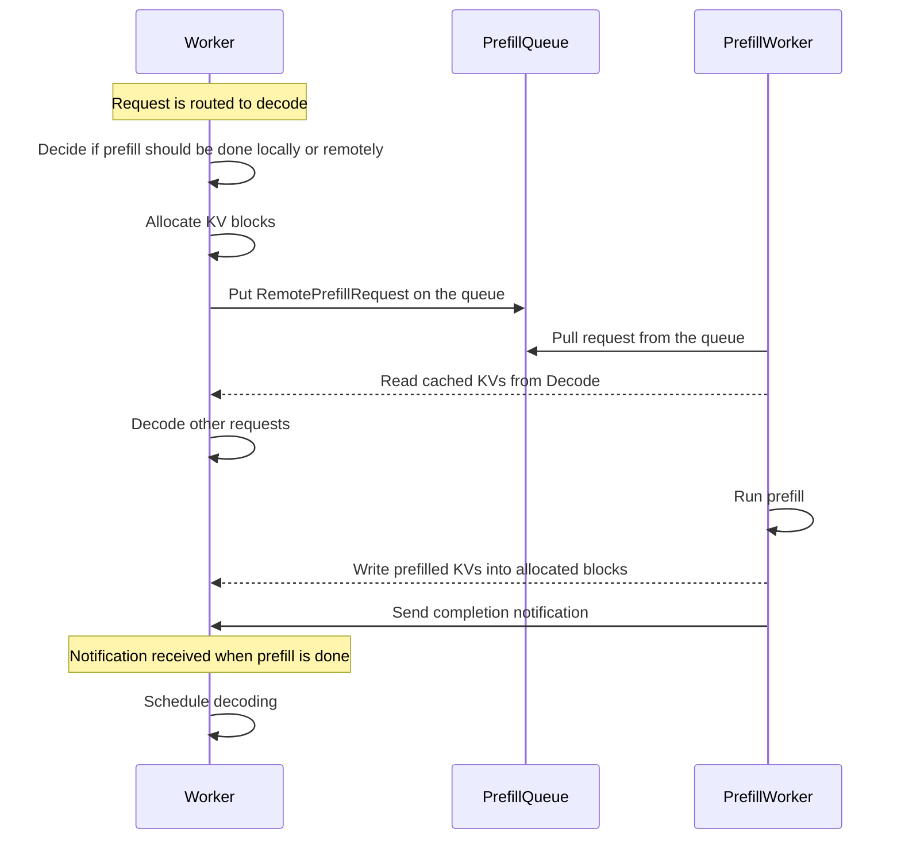
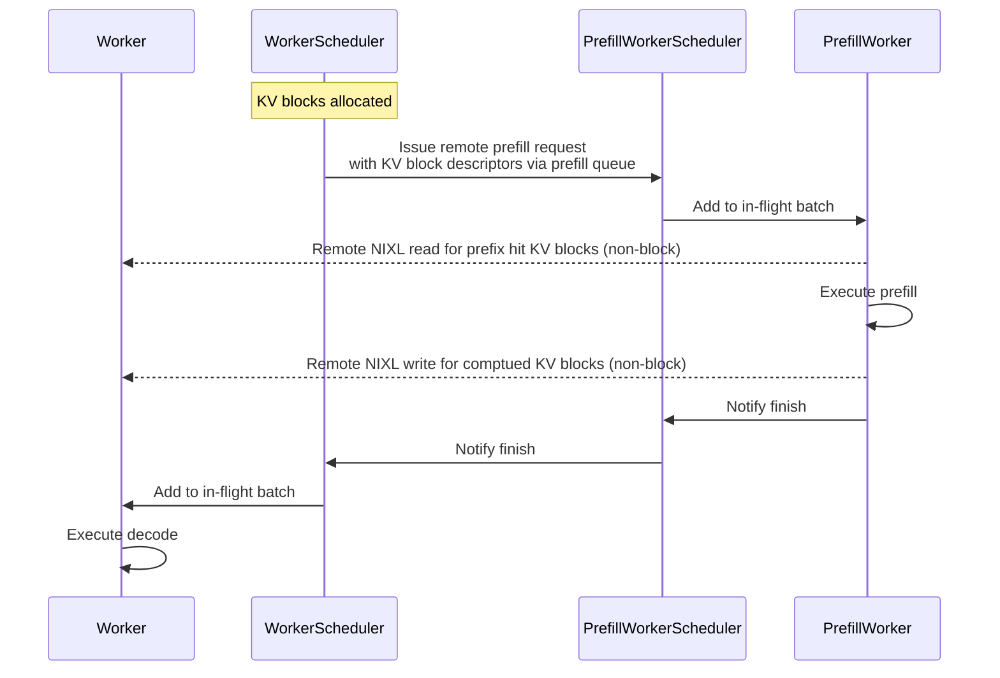

# Dynamo Disaggregation: Separating Prefill and Decode for Enhanced Performance

The prefill and decode phases of LLM requests have different computation characteristics and memory footprints. Disaggregating these phases into specialized llm engines allows for better hardware allocation, improved scalability, and overall enhanced performance. For example, using a larger TP for the memory-bound decoding phase while a smaller TP for the computation-bound prefill phase allows both phases to be computed efficiently. In addition, for requests with long context, separating their prefill phase into dedicated prefill engines allows the ongoing decoding requests to be efficiently processed without being blocked by these long prefills.

Disaggregated execution of a request has three main steps:
1. Prefill engine computes prefill phase and generates KV cache
2. Prefill engine transfers the KV cache to decode engine, and
3. Decode engine computes decode phase.

However, not all requests’ prefill phases need to be computed in the remote prefill engine. If the prefill is short or the decode engine has a high prefix cache hit, often it is more efficient to prefill locally in the decode engine. The disaggregation design in Dynamo accounts for all these scenarios and features a flexible framework that delivers strong performance across various conditions.

## Design

There are four main components in Dynamo disaggregation:
- Worker: execute prefill and decode requests
- Prefill worker: execute prefill requests only
- Disaggregated router: decide whether to prefill locally or remotely
- Prefill queue: cache and load balance the remote prefill requests

When worker receives a request, it first decides if the prefill should be done locally or remotely using the disaggregated router and allocates the KV blocks. If prefilling remotely, it then pushes a remote prefill request to the prefill queue. After that, the prefill worker pulls from prefill queue, reads KV blocks with prefix cache hit from the worker, computes the prefill, and writes the computed KV blocks back to the worker. Finally, the worker completes the remaining decoding.

## Conditional Disaggregation

Not all requests’ prefill phases need to be computed in the remote prefill engine. Disaggregated router decides whether the prefill phase of a request should be computed locally and globally at runtime based on the prefill length and prefill queue status. Specifically, a request is sent to remote prefill engine if the following two conditions are met:
1. The absolute prefill length without prefix cache hit is greater than a preset threshold. On the one hand, if the prefill length of a request is short, it can be efficiently computed in the decode engine by piggybacking chunked prefill requests with ongoing decode requests. On the other hand, if the prefix cache hit is long, the prefill becomes memory bound and hence can be more efficiently computed in the decode engine.
2. The number of remote prefill requests in the prefill queue is less than a preset threshold. When the prefill queue has a large number of prefill requests, it indicates that the prefill workers are lagging behind, and it is better to prefill locally until more prefill workers join.

Conditional disaggregation allows Dynamo to achieve high performance for dynamic workloads

## Prefill Queue

Prefill requests are computation bound (except for very short prefills) and should be executed in their dedicated iterations without any other requests to ensure fast TTFT. To balance the load across multiple prefill engines, Dynamo adopts a global prefill queue where workers push remote prefill requests and prefill workers pull and complete the requests one by one. The global prefill queue is implemented based on NATS stream to ensure high performance and availability.

## Efficient KV Transfer

The key to high-performance disaggregation is efficient KV transfer. Dynamo leverage NIXL to transfer KV cache directly from the VRAM of prefill engine to the VRAM of decode engine. In addition, the KV transfer is non-blocking, allowing GPU forward pass to serve other requests in addition to the KV transfer.

After the KV blocks are allocated, the worker scheduler sends the remote prefill requests, which contain the memory descriptors for the allocated KV blocks, to the prefill worker scheduler via prefill queue. This allows the prefill worker to read and write from the remote KV blocks without explicit handling in the remote worker engine, thanks to the RDMA read and write NIXL operations. Once the remote prefill is done, worker scheduler simply adds the decode request to the worker in-flight. This allows workers to execute forward passes of ongoing decode/prefill requests while waiting for the remote prefill to finish.

To reduce the size of memory descriptors, Dynamo applies two optimizations:
1. After each worker finishes its initialization and allocates all the KV cache pool, it stores the memory descriptor of all blocks (which is also referred to as the NIXL metadata) in ETCD, a distributed key-value store. Prefill workers load and cache the memory descriptors in one worker at the first time that it serves a remote prefill request issued by this worker. Thus, only the KV block ID instead of the full memory descriptor is needed when issuing the remote prefill request.

2. Dynamo promotes the memory allocator in the prefill engine to allocate continuous blocks and merge continuous blocks into larger blocks to reduce the total number of KV blocks.

For decode and prefill with different KV layouts (i.e., due to different TP), Dynamo applies a high-performance kernel that transposes the KV blocks into their matching layout in the KV receiver after the NIXL reads and before the NIXL writes.

## Runtime-Reconfigurable xPyD

The prefill queue and NIXL-based KV transfer design in Dynamo naturally allows runtime-reconfigurable xPyD. Workers and prefill workers can be added and removed at runtime without any system-level synchronization or overheads. New and existing prefill workers both just simply pull remote prefill requests from NATS prefill queue. The NIXL metadata of the new or existing workers (for new prefill workers) are lazily loaded and cached when necessary. Specifically, adding and removing workers and prefill workers is as easy as:

- Add worker: add NIXL metadata in ETCD.
- Remove worker: flush engine and delete NIXL metadata in ETCD.
- Add prefill worker: no explicit action needed.
- Delete prefill worker: flush engine.

