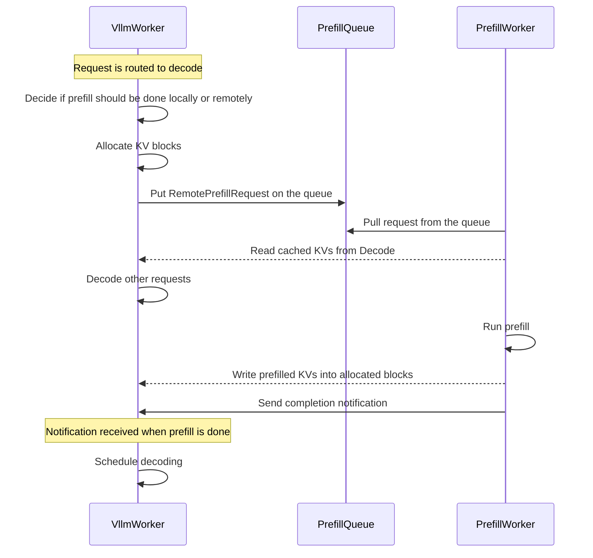

<!--
SPDX-FileCopyrightText: Copyright (c) 2025 NVIDIA CORPORATION & AFFILIATES. All rights reserved.
SPDX-License-Identifier: Apache-2.0

Licensed under the Apache License, Version 2.0 (the "License");
you may not use this file except in compliance with the License.
You may obtain a copy of the License at

http://www.apache.org/licenses/LICENSE-2.0

Unless required by applicable law or agreed to in writing, software
distributed under the License is distributed on an "AS IS" BASIS,
WITHOUT WARRANTIES OR CONDITIONS OF ANY KIND, either express or implied.
See the License for the specific language governing permissions and
limitations under the License.
-->

# LLM Deployment Examples

This directory contains examples and reference implementations for deploying Large Language Models (LLMs) in various configurations.

## Components

- workers: Prefill and decode worker handles actual LLM inference
- router: Handles API requests and routes them to appropriate workers based on specified strategy
- frontend: OpenAI compatible http server handles incoming requests

## Deployment Architectures

### Aggregated
Single-instance deployment where both prefill and decode are done by the same worker.

### Disaggregated
Distributed deployment where prefill and decode are done by separate workers that can scale independently.



## Getting Started

1. Choose a deployment architecture based on your requirements
2. Configure the components as needed
3. Deploy using the provided scripts

### Prerequisites

Start required services (etcd and NATS) using [Docker Compose](../../deploy/docker-compose.yml)
```bash
docker compose -f deploy/docker-compose.yml up -d
```

### Build docker

```
./container/build.sh
```

### Run container

```
./container/run.sh -it
```
## Run Deployment

This figure shows an overview of the major components to deploy:

```
                                                 +----------------+
                                          +------| prefill worker |-------+
                                   notify |      |                |       |
                                 finished |      +----------------+       | pull
                                          v                               v
+------+      +-----------+      +------------------+    push     +---------------+
| HTTP |----->| processor |----->| decode/monolith  |------------>| prefill queue |
|      |<-----|           |<-----|      worker      |             |               |
+------+      +-----------+      +------------------+             +---------------+
                  |    ^                  |
       query best |    | return           | publish kv events
           worker |    | worker_id        v
                  |    |         +------------------+
                  |    +---------|     kv-router    |
                  +------------->|                  |
                                 +------------------+

```

### Example architectures

#### Aggregated serving
```bash
cd /workspace/examples/llm
dynamo serve graphs.agg:Frontend -f ./configs/agg.yaml
```

#### Aggregated serving with KV Routing
```bash
cd /workspace/examples/llm
dynamo serve graphs.agg_router:Frontend -f ./configs/agg_router.yaml
```

#### Disaggregated serving
```bash
cd /workspace/examples/llm
dynamo serve graphs.disagg:Frontend -f ./configs/disagg.yaml
```

#### Disaggregated serving with KV Routing
```bash
cd /workspace/examples/llm
dynamo serve graphs.disagg_router:Frontend -f ./configs/disagg_router.yaml
```

### Client

In another terminal:
```bash
# this test request has around 200 tokens isl

curl localhost:8000/v1/chat/completions   -H "Content-Type: application/json"   -d '{
    "model": "deepseek-ai/DeepSeek-R1-Distill-Llama-8B",
    "messages": [
    {
        "role": "user",
        "content": "In the heart of Eldoria, an ancient land of boundless magic and mysterious creatures, lies the long-forgotten city of Aeloria. Once a beacon of knowledge and power, Aeloria was buried beneath the shifting sands of time, lost to the world for centuries. You are an intrepid explorer, known for your unparalleled curiosity and courage, who has stumbled upon an ancient map hinting at ests that Aeloria holds a secret so profound that it has the potential to reshape the very fabric of reality. Your journey will take you through treacherous deserts, enchanted forests, and across perilous mountain ranges. Your Task: Character Background: Develop a detailed background for your character. Describe their motivations for seeking out Aeloria, their skills and weaknesses, and any personal connections to the ancient city or its legends. Are they driven by a quest for knowledge, a search for lost familt clue is hidden."
    }
    ],
    "stream":false,
    "max_tokens": 30
  }'

```

### Multinode Examples

#### Single node sized models
You can deploy our example architectures on multiple nodes via NATS/ETCD based discovery and communication. Here's an example of deploying disaggregated serving on 2 nodes

##### Disaggregated Deployment with KV Routing
Node 1: Frontend, Processor, Router, 8 Decode
Node 2: 8 Prefill

**Step 1**: Start NATS/ETCD on your head node. Ensure you have the correct firewall rules to allow communication between the nodes as you will need the NATS/ETCD endpoints to be accessible by node 2.
```bash
# node 1
docker compose -f deploy/docker-compose.yml up -d
```

**Step 2**: Create the inference graph for this deployment. The easiest way to do this is to remove the `.link(PrefillWorker)` from the `disagg_router.py` file.

```python
# graphs/disag_router.py
# imports...
Frontend.link(Processor).link(Router).link(VllmWorker)
```

**Step 3**: Start the frontend, processor, router, and 8 VllmWorkers on node 1.
```bash
# node 1
cd /workspace/examples/llm
dynamo serve graphs.disagg_router:Frontend -f ./configs/disagg_router.yaml --VllmWorker.ServiceArgs.workers=8
```

**Step 4**: Start 8 PrefillWorkers on node 2.
Since we only want to start the `PrefillWorker` on node 2, you can simply run just the PrefillWorker component directly.

```bash
# node 2
export NATS_SERVER = '<your-nats-server-address>' # note this should start with nats://...
export ETCD_ENDPOINTS = '<your-etcd-endpoints-address>'

cd /workspace/examples/llm
dynamo serve components.prefill_worker:PrefillWorker -f ./configs/disagg_router.yaml --PrefillWorker.ServiceArgs.workers=8
```

You can now use the same curl request from above to interact with your deployment!

### Close deployment

Kill all dynamo processes managed by circusd.

```
function kill_tree() {
    local parent=$1
    local children=$(ps -o pid= --ppid $parent)
    for child in $children; do
        kill_tree $child
    done
    echo "Killing process $parent"
    kill -9 $parent
}

# kill process-tree of circusd
kill_tree $(pgrep circusd)
```
