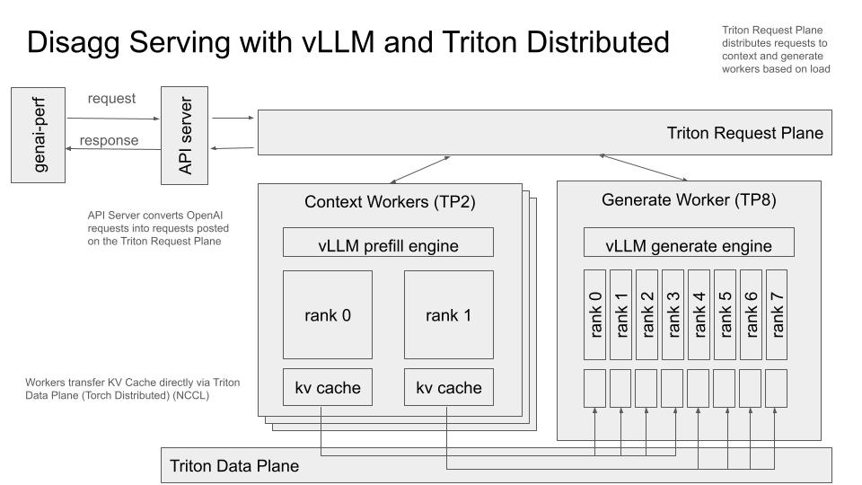

<!--
SPDX-FileCopyrightText: Copyright (c) 2024-2025 NVIDIA CORPORATION & AFFILIATES. All rights reserved.
SPDX-License-Identifier: Apache-2.0

Licensed under the Apache License, Version 2.0 (the "License");
you may not use this file except in compliance with the License.
You may obtain a copy of the License at

http://www.apache.org/licenses/LICENSE-2.0

Unless required by applicable law or agreed to in writing, software
distributed under the License is distributed on an "AS IS" BASIS,
WITHOUT WARRANTIES OR CONDITIONS OF ANY KIND, either express or implied.
See the License for the specific language governing permissions and
limitations under the License.
-->

# Disaggregated Serving

This example demonstrates **disaggregated serving** [^1] using Triton Distributed together with vLLM engines. Disaggregated serving decouples the prefill (prompt encoding) and the decode (token generation) stages of large language model (LLM) inference into separate processes. This separation allows you to independently scale, optimize, and distribute resources for each stage.

In this example, you will deploy:

- An **OpenAI-compatible API server** (which receives requests and streams responses).
- One or more **prefill workers** (for encoding the prompt).
- One or more **decode workers** (for generating tokens based on the encoded prompt).



For more details on the basics of Triton Distributed, please see the [Hello World example](../../hello_world/).

---

## 1. Prerequisites

1. **GPU Availability**
   This setup requires at least two GPUs:
   - One GPU is typically used by the **prefill** process.
   - Another GPU is used by the **decode** process.
   In production systems with heavier loads, you will typically allocate more GPUs across multiple prefill and decode workers.

2. **NATS or Another Coordination Service**
   Triton Distributed uses NATS by default for coordination and message passing. Make sure your environment has a running NATS service accessible via a valid `nats://<address>:<port>` endpoint. By default, examples assume `nats://localhost:4223`.

3. **vLLM Patch**
   This example requires some features that are not yet in the main vLLM release. A patch is automatically applied inside the provided container. Details of the patch can be found [here](../../../container/deps/vllm/). The current patch is compatible with **vLLM 0.6.3post1**.

4. **Supported GPUs**
   - For FP8 usage, GPUs with **Compute Capability >= 8.9** are required.
   - If you have older GPUs, consider BF16/FP16 precision variants instead of `FP8`. (See [below](#model-precision-variants).)

5. **HuggingFace**
   - You need a HuggingFace account to download the model and set HF_TOKEN environment variable.

---

## 2. Building the Environment

The example is designed to run in a containerized environment using Triton Distributed, vLLM, and associated dependencies. To build the container:

```bash
./container/build.sh --framework vllm
```

This command pulls necessary dependencies and patches vLLM in the container image.

---

## 3. Starting the Deployment

Below is a minimal example of how to start each component of a disaggregated serving setup. The typical sequence is:

2. **Start the Context Worker(s) and Request Plane**
3. **Start the Generate Worker(s)**
1. **Start the API Server** (handles incoming requests and coordinates workers)

All components must be able to connect to the same request plane to coordinate.

### 3.1 HuggingFace Token

```bash
export HF_TOKEN=<YOUR TOKEN>
```

### 3.2 Launch Interactive Environment

```bash
./container/run.sh --framework vllm -it
```

Note: all subsequent commands will be run in the same container for simplicity

Note: by default this command makes all gpu devices visible. Use flag

```
--gpus
```

to selectively make gpu devices visible.

### 3.2 Launch Context Worker and Request Plane

The context stage encodes incoming prompts. By default, vLLM uses GPU resources to tokenize and prepare the model’s key-value (KV) caches.

Within the container start the context worker and the request plane:

```
CUDA_VISIBLE_DEVICES=0 \
VLLM_WORKER_ID=0 \
python3 -m llm.vllm.deploy \
  --context-worker-count 1 \
  --request-plane-uri ${HOSTNAME}:4223 \
  --model-name neuralmagic/Meta-Llama-3.1-8B-Instruct-FP8 \
  --kv-cache-dtype fp8 \
  --dtype auto \
  --worker-name llama \
  --disable-async-output-proc \
  --disable-log-stats \
  --max-model-len 3500 \
  --max-batch-size 10000 \
  --gpu-memory-utilization 0.9 \
  --context-tp-size 1 \
  --generate-tp-size 1 \
  --initialize-request-plane &
```

**Key flags**:
- `--context-worker-count`: Launches only context (prefill) workers.
- `--kv-cache-dtype fp8`: Using FP8 for caching (requires CC >= 8.9).
- `CUDA_VISIBLE_DEVICES=0`: Binds worker to GPU `0`.

#### Expected Output
```
<SNIP>
Workers started ... press Ctrl-C to Exit
[168] 2025/01/24 09:17:38.879908 [INF] Starting nats-server
[168] 2025/01/24 09:17:38.879982 [INF]   Version:  2.10.24
[168] 2025/01/24 09:17:38.879987 [INF]   Git:      [1d6f7ea]
[168] 2025/01/24 09:17:38.879989 [INF]   Name:     NDBCCXARM6D2BMMRJOKZCJD4TGVXXPCJKQRXALJOPHLA5W7ISCW4VHU5
[168] 2025/01/24 09:17:38.879992 [INF]   Node:     S4g51H7K
[168] 2025/01/24 09:17:38.879995 [INF]   ID:       NDBCCXARM6D2BMMRJOKZCJD4TGVXXPCJKQRXALJOPHLA5W7ISCW4VHU5
[168] 2025/01/24 09:17:38.880339 [INF] Starting JetStream
<SNIP>
INFO 01-24 09:17:49 parallel_state.py:942] Stage: PREFILL
```

### 3.3 Launch Generate (Decode) Worker

The generate stage consumes the KV cache produced in the context step and generates output tokens.

Within the container start the generate worker:


```bash
CUDA_VISIBLE_DEVICES=1 \
VLLM_WORKER_ID=1 \
python3 -m llm.vllm.deploy \
  --generate-worker-count 1 \
  --request-plane-uri ${HOSTNAME}:4223 \
  --model-name neuralmagic/Meta-Llama-3.1-8B-Instruct-FP8 \
  --kv-cache-dtype fp8 \
  --dtype auto \
  --worker-name llama \
  --disable-async-output-proc \
  --disable-log-stats \
  --max-model-len 3500 \
  --max-batch-size 10000 \
  --gpu-memory-utilization 0.9 \
  --context-tp-size 1 \
  --generate-tp-size 1 &
```

> [!NOTE]
> - First time running in a newly launched container will
>   include model download. Please wait until you see the
>   llama handler started before sending requests


**Key flags**:
- `--generate-worker-count`: Launches decode worker(s).
- `CUDA_VISIBLE_DEVICES=1`: Binds worker to GPU `1`.

#### Expected Output

```
<SNIP>x
model-00002-of-00002.safetensors: 100% 4.08G/4.08G [01:36<00:00, 42.2MB/s]
model-00001-of-00002.safetensors: 100%% 4.71G/5.00G [01:51<00:06, 41.9MB/s]
<SNIP>
INFO 01-24 09:21:22 model_runner.py:1406] Capturing the model for CUDA graphs. This may lead to unexpected consequences if the model is not static. To run the model in eager mode, set 'enforce_eager=True' or use '--enforce-eager' in the CLI.
INFO 01-24 09:21:22 model_runner.py:1410] CUDA graphs can take additional 1~3 GiB memory per GPU. If you are running out of memory, consider decreasing `gpu_memory_utilization` or enforcing eager mode. You can also reduce the `max_num_seqs` as needed to decrease memory usage.
<SNIP>
09:22:10 worker.py:266[Triton Worker] INFO: Worker started...
09:22:10 worker.py:241[Triton Worker] INFO: Starting generate handler...
09:22:10 worker.py:266[Triton Worker] INFO: Worker started...
09:22:10 worker.py:241[Triton Worker] INFO: Starting llama handler...

```

> [!NOTE]
> - You can run multiple prefill and decode workers for higher throughput.
> - For large models, ensure you have enough GPU memory (or GPUs).

### 3.4 API Server

The API server in a vLLM-disaggregated setup listens for OpenAI-compatible requests on a chosen port (default 8005). Below is an example command:

```bash
python3 -m llm.api_server \
  --tokenizer neuralmagic/Meta-Llama-3.1-8B-Instruct-FP8 \
  --request-plane-uri ${HOSTNAME}:4223 \
  --api-server-host ${HOSTNAME} \
  --model-name llama \
  --api-server-port 8005 &
```

#### Expected Output
```
[WARNING] Adding CORS for the following origins: ['http://localhost']
INFO:     Started server process [498]
INFO:     Waiting for application startup.
TRACE:    ASGI [1] Started scope={'type': 'lifespan', 'asgi': {'version': '3.0', 'spec_version': '2.0'}, 'state': {}}
TRACE:    ASGI [1] Receive {'type': 'lifespan.startup'}
TRACE:    ASGI [1] Send {'type': 'lifespan.startup.complete'}
INFO:     Application startup complete.
INFO:     Uvicorn running on http://2u2g-gen-0349:8005 (Press CTRL+C to quit)

```

## 4. Sending Requests

Once the API server is running (by default on `localhost:8005`), you can send OpenAI-compatible requests. For example:

```bash
curl ${HOSTNAME}:8005/v1/chat/completions \
  -H "Content-Type: application/json" \
  -d '{
    "model": "llama",
    "messages": [
      {"role": "user", "content": "What is the capital of France?"}
    ],
    "temperature": 0,
    "top_p": 0.95,
    "max_tokens": 25,
    "stream": true,
    "n": 1,
    "frequency_penalty": 0.0,
    "stop": []
  }'
```

The above request will return a streamed response with the model’s answer.


#### Expected Output

```
INFO 01-24 09:33:05 async_llm_engine.py:207] Added request 052eabe0-fc54-4f7c-9be8-4926523b26fc___0.
INFO 01-24 09:33:05 kv_cache.py:378] Fetching source address for worker 0 by key worker_0_rank_0
TRACE:    127.0.0.1:49878 - ASGI [2] Send {'type': 'http.response.body', 'body': '<290 bytes>', 'more_body': True}
data: {"id":"052eabe0-fc54-4f7c-9be8-4926523b26fc","choices":[{"delta":{"content":"\n\n","role":"assistant"},"logprobs":null,"finish_reason":null,"index":0}],"created":1737711185,"model":"llama","system_fingerprint":"052eabe0-fc54-4f7c-9be8-4926523b26fc","object":"chat.completion.chunk"}

INFO 01-24 09:33:05 async_llm_engine.py:175] Finished request 052eabe0-fc54-4f7c-9be8-4926523b26fc___0.
TRACE:    127.0.0.1:49878 - ASGI [2] Send {'type': 'http.response.body', 'body': '<317 bytes>', 'more_body': True}
TRACE:    127.0.0.1:49878 - ASGI [2] Send {'type': 'http.response.body', 'body': '<14 bytes>', 'more_body': True}
TRACE:    127.0.0.1:49878 - ASGI [2] Send {'type': 'http.response.body', 'body': '<0 bytes>', 'more_body': False}
data: {"id":"052eabe0-fc54-4f7c-9be8-4926523b26fc","choices":[{"delta":{"content":"The capital of France is Paris.","role":"assistant"},"logprobs":null,"finish_reason":null,"index":0}],"created":1737711185,"model":"llama","system_fingerprint":"052eabe0-fc54-4f7c-9be8-4926523b26fc","object":"chat.completion.chunk"}

TRACE:    127.0.0.1:49878 - ASGI [2] Receive {'type': 'http.disconnect'}
data: [DONE]

```

## 5. Benchmarking

You can benchmark this setup using [**GenAI-Perf**](https://github.com/triton-inference-server/perf_analyzer/blob/main/genai-perf/README.md), which supports OpenAI endpoints for chat or completion requests.

```bash
genai-perf profile \
  -m llama \
  --url ${HOSTNAME}:8005 \
  --endpoint-type chat \
  --streaming \
  --num-dataset-entries 1000 \
  --service-kind openai \
  --endpoint v1/chat/completions \
  --warmup-request-count 10 \
  --random-seed 123 \
  --synthetic-input-tokens-stddev 0 \
  --output-tokens-stddev 0 \
  --tokenizer neuralmagic/Meta-Llama-3.1-70B-Instruct-FP8 \
  --synthetic-input-tokens-mean 300 \
  --output-tokens-mean 3000 \
  --extra-inputs seed:100 \
  --extra-inputs min_tokens:150 \
  --extra-inputs max_tokens:150 \
  --profile-export-file my_profile_export.json \
  --artifact-dir artifacts/ \
  --concurrency 32 \
  --request-count 320 \
  -- -v \
  --async
```

**Key Parameters**:
- **`-m llama`**: Your model name (must match the name used in your server).
- **`--url <API_SERVER_HOST>:8005`**: The location of your API server.
- **`--endpoint v1/chat/completions`**: Using the OpenAI chat endpoint.
- **`--streaming`**: Ensures tokens are streamed back for chat-like usage.


## 6. Teardown

To tear down a deployment during local development, you can either kill the
container or the kill the relevant processes involved in the deployment.

To kill the processes being run inside the container, you can run:
```bash
pkill -9 -f python3
pkill -9 -f nats-server
```

You will generally want to make sure you have a clean slate between
deployments to avoid any unexpected errors.

NOTE: If you have other unrelated processes in the environment with `python3`
in the name, the `pkill` command above will terminate them as well. In this
scenario, you could select specific process IDs and use the following command
instead for each process ID replacing `<pid>` below:
```
kill -9 <pid>
```


## 7. Model Precision Variants

In the commands above, we used the FP8 variant `neuralmagic/Meta-Llama-3.1-8B-Instruct-FP8` because it significantly reduces KV cache size, which helps with network transfer and memory usage. However, if your GPU is older or does not support FP8, try using the standard BF16/FP16 precision variant, for example:

```bash
--model-name meta-llama/Meta-Llama-3.1-8B-Instruct
--kv-cache-dtype bf16
```


## 8. Multi-node Deployment

To deploy the solution in a multi-node environment please refer to [deploy_llama_8b_disaggregated_multinode.sh](examples/llm/vllm/deploy/deploy_llama_8b_disaggregated_multinode.sh) script. On a head node run NATS server, API server and context worker with

```
./examples/llm/vllm/deploy/deploy_llama_8b_disaggregated.sh context --head-url <head url>
```

On the second node run the generate worker

```
./examples/llm/vllm/deploy/deploy_llama_8b_disaggregated.sh generate --head-url <head url>
```
The example script is set by default to launch one context worker with TP 1 on the head node and one generate worker with TP 1 on the secondary node. This can be changed for other configurations - see the script for details.


## 9. Known Issues & Limitations

1. **Fixed Worker Count**
   Currently, the number of prefill and decode workers must be fixed at the start of deployment. Dynamically adding or removing workers is not yet supported.

2. **KV Transfer OOM**
   During heavy loads, KV cache transfers between prefill and decode processes may cause out-of-memory errors if there is insufficient GPU memory.

3. **KV Cache Preemption**
   Cache preemption (evicting old prompts to free memory) is not supported in the current patch.

4. **Experimental Patch**
   The required vLLM patch is experimental and not yet merged into upstream vLLM. Future releases may remove the need for a custom patch.

5. **Single generate worker**
   Only one generate worker can be used in a single deployment.

6. **Streaming**
   When streaming is enabled, only two responses will be returned in the stream: the first token and the complete response.


## 10. References

[^1]: Yinmin Zhong, Shengyu Liu, Junda Chen, Jianbo Hu, Yibo Zhu, Xuanzhe Liu, Xin Jin, and Hao
Zhang. Distserve: Disaggregating prefill and decoding for goodput-optimized large language
model serving. *arXiv:2401.09670v3 [cs.DC]*, 2024.

For more details on Triton Distributed and additional examples, please consult the official [Hello World example](../../hello_world/) and the [Triton Inference Server documentation](https://github.com/triton-inference-server/server).
